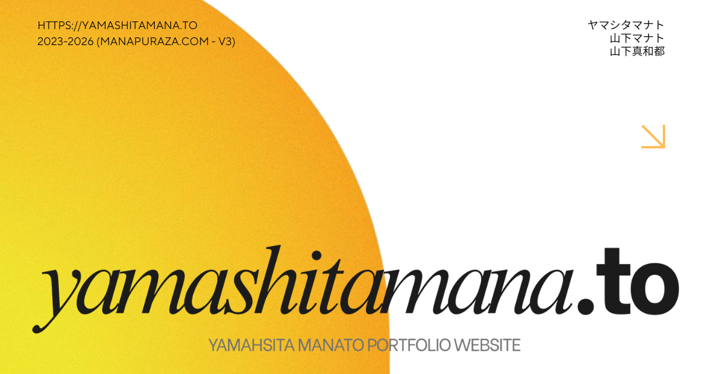

# yamashitamana.to 🍌
山下マナト Webポートフォリオ

<div align="center">
  

  <br/>
  <a href="https://vuejs.org/" target="_blank"></a>
  <a href="https://vitejs.dev/" target="_blank"></a>
  <a href="https://www.typescriptlang.org/" target="_blank"></a>
  <a href="https://threejs.org/" target="_blank"></a>
  <a href="https://vue-i18n.intlify.dev/" target="_blank"></a>
  <a href="https://microcms.io/" target="_blank"></a>
</div>

## About

山下マナト（山下真和都）のWebポートフォリオです。2021–2026に制作したクリエイティブを整理し、現在も継続改善しています。

### Version History

- **v3 (Current)**: [yamashitamana.to](https://yamashitamana.to) - 株式会社LIGのYouTube企画にてデザイナー保科氏のフィードバックを受けてデザインをさらに改善。TypeScript完全移行、microCMSによるコンテンツ管理を導入。
- **v2**: [manapuraza.netlify.app](https://manapuraza.netlify.app/) - 株式会社Puzzleインターン中、エンジニア・デザイナーのフィードバックを受けてデザインをバージョンアップ。
- **v1**: [ver1.0](https://manapuraza-s0y8f8i94-manatoyamashita.vercel.app) - オーストラリア留学中にVue.jsで開発。

## Stack

- フロントエンド
  - Vue 3.5.26 (Composition API, TypeScript Strict Mode)
  - Vite 6.2.3
  - Vue Router 4.6.4（HTML5 History、動的ルーティング）
  - Vue I18n 9
  - Three.js 0.169.0 / GSAP 3.12.5
  - Font Awesome（必要アイコンのみツリーシェイク）
  - marked（Markdownレンダリング）
- CMS / データ管理
  - microCMS（ヘッドレスCMS）
  - LocalStorageキャッシュ（30分TTL）
- ビルド/最適化
  - TypeScript 5.3.3（Strictモード、100%型カバレッジ）
  - 手動コード分割（`vendor`, `vendor_three`, `vendor_fontawesome`, `vendor_gsap`）
  - Terser 最適化（`drop_debugger`, 選択的console削除）
  - Source Map 出力
- デプロイ
  - 本番: 静的ホスティング（FTP配信、GitHub Actions）
  - デモ: Vercel

Node.js 要件（Vite準拠）: Node 20.19+ または 22.12+。参考: [Vite Getting Started](https://vitejs.dev/guide/)

## Quick Start

```bash
# 環境変数設定（初回のみ）
cp .env.example .env
# VITE_MICROCMS_API_ENDPOINT と VITE_MICROCMS_API_KEY を設定

# 依存関係インストール
npm install

# 開発サーバー起動
npm run dev      # http://localhost:5173

# プロダクションビルド（vite-ssg により静的4ページをプリレンダリング）
npm run build    # プロダクションビルド（/dist）
npm run preview  # ローカルで/distを確認

# コード品質チェック
npm run typecheck   # TypeScript型チェック
npm run lint        # ESLint検証
npm run format      # Prettierフォーマット

# バンドル分析
npm run analyze  # バンドル可視化（rollup-plugin-visualizer）

# microCMSデータ管理（オプション）
npm run generate-csv           # microCMS用CSVデータ生成
npm run update-csv-images      # CSV内の画像URL更新
npm run update-csv-from-urls   # URL一覧からCSV更新
```

## アーキテクチャ概要

### TypeScript完全移行
- **Strictモード有効**: `strict: true` + 追加の厳格オプション
- **100%型カバレッジ**: 全コンポーネント、ユーティリティ、設定ファイル
- **ゼロエラーポリシー**: コミット時に型エラー・ESLintエラーゼロを要求
- 詳細: `docs/typescript-migration.md`, `docs/standards/typescript-coding-standards.md`

### microCMS統合
- **ヘッドレスCMS**: ポートフォリオ作品データをmicroCMSで管理
- **API Client**: `src/composables/useCreativesAPI.ts` - Composableパターン
- **キャッシュ戦略**: LocalStorage + 30分TTL
- **データフロー**: `microCMS API → Composable → LocalStorage → Vue Components`
- **型安全**: `src/types/microcms.ts` で完全な型定義
- セットアップ: `docs/ops/microcms-setup.md`
- 運用ガイド: `docs/ops/creatives-guide.md`

### Vue.js アーキテクチャ
- **単一Vueインスタンス + MetaBall**: Main App + MetaBall（router/i18n/head共有）
- **Composition API**: 全コンポーネントで`<script setup lang="ts">`記法使用
- **レスポンシブナビゲーション**: Menu.vueで統一（デスクトップ/モバイル対応）
- **動的ルーティング**: `/creatives/:category/:id` で作品詳細ページ
- **国際化**: Vue I18n 9（日本語/英語、遅延ローディング）

### エントリポイントとルーティング
- エントリ: `index.html`（クリティカルCSSインライン、重要画像preload）
- アプリ初期化: `src/main.ts`
  - `createApp(App)` を `#app` にマウント
  - Three.js使用の `MetaBall` は `requestIdleCallback` で遅延ロード、`#back` にマウント
  - メインCSS（`/src/assets/main.css`）は初回描画後に遅延ロード
- ルーティング: `src/router/index.ts`（型安全な動的ルーティング）
  - `/`（Home）, `/about`, `/creatives`, `/creatives/:category/:id`, `/:pathMatch(.*)*`（404）
  - すべてのサブページは遅延インポート

### 国際化（i18n）
- リソース: `locales/ja.json`, `locales/en.json`
- 初期レンダリング: 日本語のみ同期ロード
- 英語: アイドル時に遅延ロード
- Fallback: `fallbackLocale: 'en'`
- 参考: [Vue I18n Lazy Loading](https://vue-i18n.intlify.dev/guide/advanced/lazy.html)

## プロジェクト構成

```
manapuraza/
├── public/                     # 静的ファイル
│   ├── ogp.webp                # OGPイメージ
│   ├── robots.txt              # SEO設定
│   ├── sitemap.xml             # サイトマップ
│   └── .htaccess               # Apache SPAフォールバック設定
├── src/
│   ├── components/             # Vueコンポーネント（TypeScript）
│   │   ├── MetaBall.vue        # Three.js背景アニメーション（遅延ロード）
│   │   ├── Menu.vue            # 統合ナビゲーション（デスクトップ/モバイル）
│   │   ├── CreativeItem.vue    # ポートフォリオカード表示
│   │   ├── AboutHero.vue       # プロフィールヒーローセクション
│   │   ├── AnimationSection.vue # アニメーションセクション
│   │   ├── Btn.vue             # 再利用可能ボタン
│   │   └── Sns.vue             # SNSリンク
│   ├── views/                  # ページレベルコンポーネント（TypeScript）
│   │   ├── Home.vue            # トップページ
│   │   ├── About.vue           # 自己紹介ページ
│   │   ├── Creatives.vue       # ポートフォリオ一覧ページ
│   │   ├── CreativeDetail.vue  # 作品詳細ページ（動的ルーティング）
│   │   ├── Contact.vue         # お問い合わせページ
│   │   └── 404.vue             # 404エラーページ
│   ├── composables/            # Vue Composables（TypeScript）
│   │   └── useCreativesAPI.ts  # microCMS APIクライアント
│   ├── types/                  # TypeScript型定義
│   │   ├── index.ts            # エクスポート集約
│   │   ├── creatives.ts        # Creative/ポートフォリオ型
│   │   ├── microcms.ts         # microCMS API型
│   │   ├── router.ts           # ルーターパラメータ型
│   │   ├── i18n.ts             # 国際化型
│   │   └── components.ts       # コンポーネントProps型
│   ├── assets/                 # アセット
│   │   ├── main.css            # メインスタイルシート（遅延ロード）
│   │   ├── logo.webp           # 高画質ロゴ
│   │   └── logo-low.webp       # 低画質ロゴ（初期表示）
│   ├── router/
│   │   └── index.ts            # Vue Routerセットアップ（TypeScript）
│   ├── App.vue                 # ルートコンポーネント
│   └── main.ts                 # アプリケーションエントリ（TypeScript）
├── locales/                    # 国際化リソース
│   ├── ja.json                 # 日本語翻訳（初期ロード）
│   └── en.json                 # 英語翻訳（遅延ロード）
├── docs/                       # プロジェクトドキュメント
│   ├── index.md                # ドキュメント索引
│   ├── standards/              # コーディング規約・ガイドライン
│   ├── ops/                    # 運用手順書
│   └── dev/                    # 開発環境構築
├── scripts/                    # データ管理スクリプト
│   ├── generate-microcms-csv.ts       # microCMS用CSV生成
│   ├── update-csv-image-urls.ts       # CSV画像URL更新
│   └── update-csv-from-urls.ts        # URL一覧からCSV更新
├── .github/
│   └── workflows/
│       └── deploy.yml          # GitHub Actions デプロイ設定
├── index.html                  # HTMLエントリ（クリティカルCSS含む）
├── vite.config.ts              # Vite設定（TypeScript、コード分割・最適化）
├── tsconfig.json               # TypeScript設定（Strictモード）
├── .env                        # 環境変数（Git管理外）
├── CLAUDE.md                   # Claude Code開発ガイド
└── README.md                   # プロジェクト説明書
```

### 主要ディレクトリの詳細

#### `src/components/`
- **MetaBall.vue**: Three.js使用の3D背景。`requestIdleCallback`で遅延読み込み
- **Menu.vue**: デスクトップ/モバイル統合ナビゲーション。レスポンシブデザイン完全対応
- **CreativeItem.vue**: 統合ポートフォリオコンポーネント。全カテゴリ対応（Animation/Development/Illustration/Video/Design）
- **AboutHero.vue**: プロフィール画像（正円維持）、自己紹介テキスト、SNSリンク

#### `src/views/`
- **Home.vue**: ランディングページ。MetaBallとの連携、ホーム専用メニュー
- **Creatives.vue**: ポートフォリオ一覧。CreativeItemコンポーネント使用、カテゴリフィルタ
- **CreativeDetail.vue**: 作品詳細ページ。Markdownレンダリング、画像ギャラリー、YouTube embed
- **Contact.vue**: お問い合わせフォーム。GSAP animations対応

#### `src/composables/`
- **useCreativesAPI.ts**: microCMS APIクライアント
  - データフェッチング、キャッシング、アダプター
  - メソッド: `fetchCreatives()`, `getCreativesByCategory()`, `getCreativeById()`
  - LocalStorage + 30分TTL

#### `src/types/`
- **microcms.ts**: microCMS API型定義（categories, creatives）
- **creatives.ts**: Creative/ポートフォリオ型（`CMSCreative`, `CreativeDetail`, `CtaButton`）
- **router.ts**: Vue Routerパラメータ型（`CreativeCategory`）
- **i18n.ts**: 国際化型（`Locale`, `MessageSchema`）

#### アセット管理
- **WebP形式**: 全画像をWebPで最適化
- **プログレッシブローディング**: logo-low.webp → logo.webpの段階読み込み
- **microCMS画像**: 全ポートフォリオ画像はmicroCMSでホスト（CDN配信）

## 技術仕様とアーキテクチャ

### TypeScript Strictモード
**`tsconfig.json`設定:**
- `strict: true` - 全厳格型チェックオプション有効
- `noUnusedLocals: true` - 未使用ローカル変数をエラー報告
- `noUnusedParameters: true` - 未使用パラメータをエラー報告
- `noImplicitReturns: true` - 全コードパスで戻り値保証
- `noUncheckedIndexedAccess: true` - インデックス署名結果にundefined追加
- `noFallthroughCasesInSwitch: true` - switch文のフォールスルーをエラー報告

### Vue.js アーキテクチャ
- **単一Vueインスタンス**: Main App + MetaBall（各々独立にマウント、router/i18n/head共有）
- **Composition API**: 全コンポーネントで`<script setup lang="ts">`記法
- **型安全Props**: `defineProps<Props>()`でランタイム型チェック
- **Emits型定義**: `defineEmits<EmitTypes>()`で型安全なイベント発行

### 状態管理とデータフロー
- **Props-based**: 親子間通信はProps/Emitsパターン
- **Composable**: `useCreativesAPI()`でmicroCMSデータ管理
- **リアクティブ**: `computed`, `ref`, `watch`でリアクティブ状態管理
- **キャッシュ戦略**: LocalStorage + 30分TTL（`CACHE_DURATION: 30 * 60 * 1000`）

### パフォーマンス戦略
- **Code Splitting**: Vite `manualChunks`で依存を論理分割
- **Lazy Loading**: ルート、コンポーネント、翻訳の段階的読み込み
- **Critical Resource Priority**: 初期描画に必要な最小リソースを優先
- **Idle Time Utilization**: `requestIdleCallback`でバックグラウンド処理
- **画像最適化**: WebP形式、レスポンシブsrcset、lazyロード
- **microCMSキャッシュ**: LocalStorageで30分間キャッシュ、APIリクエスト削減

### エラーハンドリング
- **コンポーネントレベル**: `errorCaptured`でエラー境界設定
- **ルーターレベル**: `router.onError`でナビゲーションエラー処理
- **Promise/Async**: try-catch + フォールバック値で堅牢性確保
- **API エラー**: `useCreativesAPI()`で`error` refを返し、UIにエラー表示

## パフォーマンス最適化


- 遅延読み込み
  - Three.js / `MetaBall` をアイドル時に動的インポート
  - 英語ロケールをアイドル時にロード
  - メインCSSを初回描画後に追加ロード
- コード分割
  - Vite Rollup `manualChunks` により依存を論理分割
- 画像最適化
  - WebP採用、`index.html` で `favicon.png` を preload
  - microCMS CDN配信、レスポンシブsrcset対応
- ビルド最適化
  - Terser圧縮（`drop_debugger`, 選択的console削除）
- キャッシュ戦略
  - LocalStorage + 30分TTL（microCMS APIレスポンス）

## microCMS統合

### データフロー
```
microCMS API
  ↓
useCreativesAPI Composable (src/composables/useCreativesAPI.ts)
  ↓
LocalStorage Cache (30分TTL)
  ↓
Vue Components (Creatives.vue, CreativeDetail.vue)
```

### 主要API
- **categories API**: カテゴリ情報（animation/development/illustration/video/design）
- **creatives API**: 作品情報（タイトル、説明、サムネイル、詳細画像、YouTube URL等）

### Composable API
```typescript
const {
  fetchCreatives,              // 全作品取得
  getCreativesByCategory,      // カテゴリ別取得
  getCreativeById,             // 個別作品取得
  isLoading,                   // ローディング状態
  error                        // エラー状態
} = useCreativesAPI();
```

### 環境変数
`.env` ファイルで設定:
```env
VITE_MICROCMS_API_ENDPOINT=https://your-service.microcms.io/api/v1
VITE_MICROCMS_API_KEY=your-read-only-api-key
```

### セットアップ詳細
- 初期セットアップ: `docs/ops/microcms-setup.md`
- データ管理: `docs/ops/creatives-guide.md`

## SEO / アナリティクス

- `index.html` に SEOメタ、OG/Twitterカード、構造化データ（JSON-LD）を実装
- **動的SEO**: `@vueuse/head`で各ページのmeta/titleを動的生成
- Google Analytics はユーザー操作/アイドル時に超遅延ロード（ビーコン送信、IP匿名化、有効最小設定）
- `public/robots.txt`, `public/sitemap.xml` を配置

## ルーティングとSPAフォールバック

- `createWebHistory()` を使用
- 開発サーバは SPA フォールバック有効
- 本番静的配信では、サーバ側で `index.html` へのフォールバック設定を推奨
  - Apache: `public/.htaccess`（リポジトリに含まれる）
  - Nginx:
    ```nginx
    location / {
      try_files $uri $uri/ /index.html;
    }
    ```

## 国際化（i18n）

- リソース
  - `locales/ja.json`, `locales/en.json`
- 実装要点
  - 初期レンダリングは `ja` のみロード、`en` は非同期追加
  - `fallbackLocale: 'en'` によりキー欠損時に英語へフォールバック
- 翻訳の追加手順
  1. `locales/ja.json` と `locales/en.json` に新規キーを追加
  2. 再読み込み不要（英語は遅延読込後に `setLocaleMessage` 済み）

## デザイン方針


[Figma link](https://www.figma.com/design/XW4k9FCVkEjovbucl4XtWx/manapuraza.com?node-id=0-1&t=EJ28mq4TUObSEY9m-1)

- Grassmorphism / 軽量なトランジション
- モバイルファースト（レスポンシブデザイン完全対応）
- カラー
  - メイン: イエロー/オレンジ（バナナモチーフ）
  - アクセント: 水色

## バンドル分析

- `npm run analyze` → `rollup-plugin-visualizer` により依存とチャンクを可視化

## セキュリティとアクセシビリティ

- 主要対策
  - 不要なスクリプトの排除、遅延読込で攻撃面縮小
  - 画像の `alt`、適切な `aria` 属性の付与
  - **microCMS APIキー**: 読み取り専用キーのみフロントエンドで使用（公開OK）
- 補足（推奨事項）
  - 本番配信での適切な CSP 設定
  - 依存の継続アップデート

## スクリプト一覧

```json
{
  "dev": "vite",
  "build": "vue-tsc --noEmit && vite build",
  "preview": "vite preview",
  "analyze": "vite build --mode=analyze",
  "typecheck": "vue-tsc --noEmit",
  "lint": "eslint . --fix",
  "lint:check": "eslint .",
  "format": "prettier --write \"src/**/*.{js,ts,vue,css}\"",
  "format:check": "prettier --check \"src/**/*.{js,ts,vue,css}\"",
  "generate-csv": "tsx scripts/generate-microcms-csv.ts",
  "update-csv-images": "tsx scripts/update-csv-image-urls.ts",
  "update-csv-from-urls": "tsx scripts/update-csv-from-urls.ts"
}
```

## ライセンス

© 2023– Manato Yamashita. All Rights Reserved.

---
最終更新: 2026-01-12
